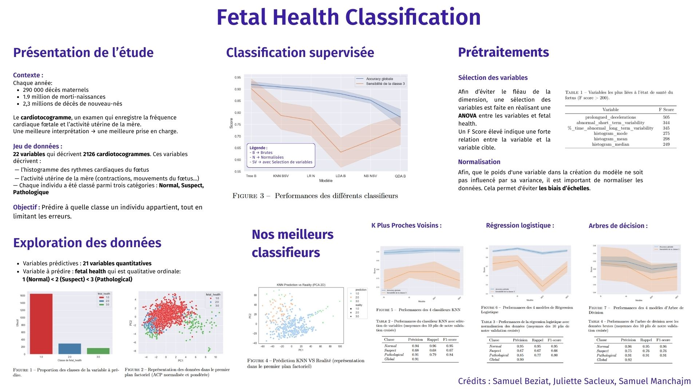

# Fetal Health Classification



## Project Description

This project aims to analyze and predict fetal health status based on cardiotocograph (CTG) results. Using machine learning techniques, we classify fetal health into three categories: Normal, Suspect, and Pathological. This work was conducted as part of the SY09 course (Data Analysis and Data Mining) at the University of Technology of Compiègne (UTC).

## Installation Instructions

To set up this project locally, follow these steps:

1. Clone the repository:
   ```
   git clone https://github.com/your-username/fetal-health-classification.git
   ```
2. Install the required dependencies:
   ```
   pip install -r requirements.txt
   ```

## Data Source

The dataset used in this project is from:

* *Ayres de Campos et al. (2000) SisPorto 2.0 A Program for Automated Analysis of Cardiotocograms. J Matern Fetal Med 5:311-318* [Link to the original paper](https://onlinelibrary.wiley.com/doi/10.1002/1520-6661(200009/10)9:5%3C311::AID-MFM12%3E3.0.CO;2-9)

The dataset contains 2126 records of features extracted from Cardiotocogram exams, classified by three expert obstetricians. We performed the following preprocessing steps:

## Code Structure

The project is organized as follows:

- `Notebooks/`: Jupyter notebooks for exploratory data analysis and model development
- `Rapports/`: Project reports and visualizations

## Results and Evaluation

We implemented several machine learning models, including Discriminant Analysis, Random Forest and KNN.

You can find our results on our report and our poster : 
* [Final Report (Fr)](Rapports\Rapport_de_projet_SY09.pdf)
* [Poster (Fr)](Rapports\Poster_SY09.pdf)


## Contributors 

* Juliette Sacleux
* Samuel Manchajm
* Samuel Beziat

## License

This project is released under the [GNU GPL 3.0 License](https://choosealicense.com/licenses/gpl-3.0/). The dataset used in this project is subject to the original authors' terms and conditions.

## Contributors

- Juliette Sacleux
- Samuel Manchajm
- Samuel Beziat

For any questions or suggestions, please contact us. 